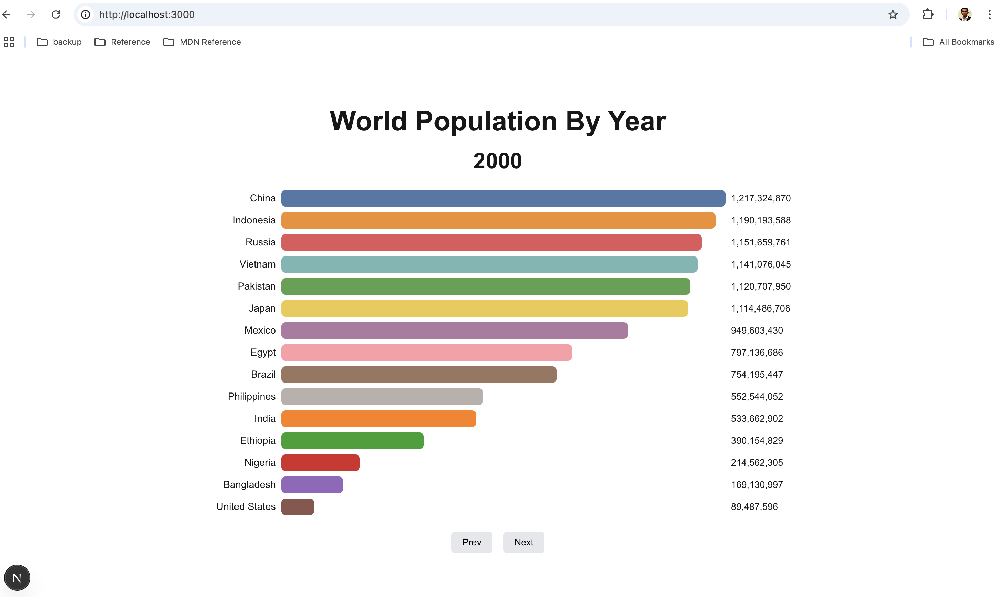

**Project Overview & Implementation details:**

Task - Create a World Population Chart using NextJS, TypeScript, Unit Testing(TDD approach)

**Features Added**

1) World Population chart (Created without depending on any third party library for graphs)
2) Developed using NextJS (latest version)
3) Pagination
4) Type script used for Type Safety
5) Unit test cases for Utils, Pages and for the Pagination component
6) Responsive to fit any device.
7) Data loaded from provided json
8) Color coded as per the request

**UX**
****************

****************************************************************************************

**Tech-Stack Used for Development**
*******************************

NextJS, TypeScript, Jest, React Testing Library

**********************************************

**How to Run & Test**
*******************

Prerequisites Before running the application, ensure you have:

Node.js (v16 or higher recommended)

npm or yarn package manager

git clone [[repository-url](https://github.com/kishorjoseph/codehouse-chart-pj.git)] https://github.com/kishorjoseph/codehouse-chart-pj.git

**cd to codehouse-chart-pj**

Install dependencies: 

**npm install**

4.Start the React development server:

**npm run dev**

http://localhost:3000/

To run all the test 

**npm run test**